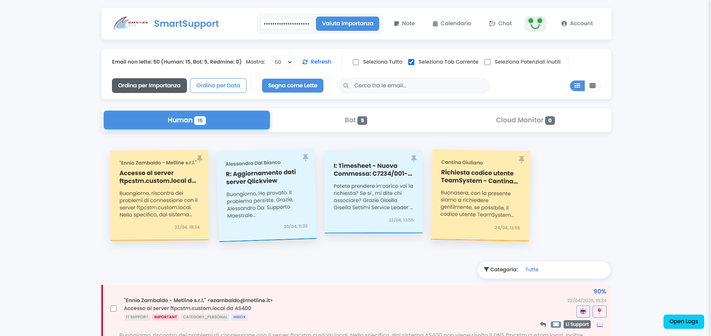

# SmartSupport 🚀

SmartSupport è un'applicazione avanzata per la gestione intelligente delle email e l'automazione dei ticket su Redmine. Combina un backend Node.js, un server di classificazione Python basato su Machine Learning e una dashboard frontend moderna.



## Caratteristiche Principali

- 📧 **Integrazione Gmail**: Legge e processa automaticamente le email (ottimizzato per "Cloud Monitor").
- 🐞 **Automazione Redmine**: Crea, aggiorna e risolve automaticamente i ticket basandosi sul contenuto delle email.
- 🤖 **Classificazione AI**: Utilizza modelli Python (Transformers/LLM) per distinguere tra email generate da Bot e comunicazioni Umane.
- 🔐 **Sicurezza**: Supporta autenticazione LDAP (Active Directory) e Multi-Factor Authentication (MFA) tramite TOTP (Google Authenticator, Authy, ecc.).
- 📊 **Dashboard Moderna**: Interfaccia web intuitiva per monitorare le email e lo stato del sistema.

---

## Prerequisiti

Prima di iniziare, assicurati di avere installato:
- [Node.js](https://nodejs.org/) (v16 o superiore)
- [Python 3.8+](https://www.python.org/)
- Un account Google con [Gmail API abilitata](https://developers.google.com/gmail/api/quickstart/js)
- Accesso a un'istanza Redmine (con API Key)

---

## Setup del Progetto

### 1. Clonazione e Dipendenze Node.js
```bash
# Installa le dipendenze del backend
npm install
```

### 2. Dipendenze Python (Server di Predizione)
Si consiglia di utilizzare un ambiente virtuale:
```bash
# Crea un ambiente virtuale
python -m venv venv
# Attivalo (Windows)
.\venv\Scripts\activate
# Attivalo (Linux/macOS)
source venv/bin/activate

# Installa le dipendenze
pip install -r requirements.txt
```

### 3. Configurazione Ambiente
1. Copia il file `.env.example` in `.env`:
   ```bash
   cp .env.example .env
   ```
2. Modifica `.env` con le tue chiavi API, credenziali Redmine e configurazioni LDAP.
3. Copia `users.json.example` in `users.json` per configurare gli utenti locali.

### 4. Configurazione Google API
1. Scarica il file `client_secret.json` dalla Google Cloud Console.
2. Rinominato in `client_secret.json` e inseriscilo nella root del progetto.
3. Esegui il comando per generare il token di accesso iniziale:
   ```bash
   node generate_token.js
   ```
   Segui le istruzioni nel terminale per autorizzare l'applicazione.

---

## Lancio dell'Applicazione

Per il corretto funzionamento, devono essere attivi entrambi i server.

### Avvio Server di Classificazione (Python)
```bash
# Assicurati che l'ambiente virtuale sia attivo
python prediction_server.py
```
*Il server sarà in ascolto sulla porta 5001 (HTTPS).*

### Avvio Server Principale (Node.js)
```bash
node index.js
```
*L'applicazione sarà accessibile all'indirizzo configurato (default http://localhost).*

---

## Funzionamento Tecnico

1. **Sincronizzazione**: `index.js` esegue un ciclo ogni 15 secondi cercando nuove email da "Cloud Monitor" tramite Gmail API.
2. **Parsing**: Il sistema estrae Host, Servizio e Stato (OK, CRIT, WARN) dal corpo dell'email.
3. **Automazione Ticket**: Se viene rilevato un problema, viene creato un ticket Redmine. Se il problema si risolve (email OK), il ticket viene aggiornato o chiuso.
4. **Classificazione**: Le email vengono inviate al server Python (`prediction_server.py`) che utilizza modelli pre-addestrati per classificarle.
5. **Sicurezza**: L'accesso alla dashboard è protetto. Se l'utente ha l'MFA abilitato, dovrà inserire il codice TOTP dopo la password.

---

## File Essenziali nel Repository

- `index.js`: Server principale Node.js.
- `prediction_server.py`: Server Flask per la classificazione AI.
- `public/`: Contiene HTML, CSS e JS del frontend.
- `package.json`: Dipendenze e script Node.js.
- `requirements.txt`: Dipendenze Python.
- `create_redmine_tickets.js`: Logica specifica per l'integrazione Redmine.
- `generate_token.js`: Utility per l'autenticazione Gmail.

---

## Note per lo Sviluppo Gratis

L'applicazione può essere eseguita gratuitamente utilizzando:
- **Gmail API**: Piano free (con limiti generosi).
- **Redmine**: Istanza self-hosted o gratuita.
- **Modelli AI**: Utilizza modelli open-source (DistilBART) via HuggingFace (Transformers), eseguibili localmente senza costi di API esterne.
